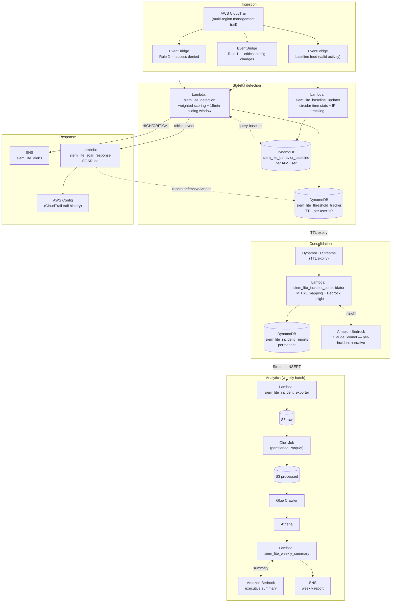

# SIEM Lite

A serverless, event-driven SIEM built end-to-end on AWS — detection, AI-assisted triage, automated response, and analytics — designed as a portfolio project that reflects real security-engineering trade-offs, not just working code.

> **Status:** core pipeline (detection → triage → response → analytics) is complete and validated end-to-end with real AWS events. Infrastructure-as-code (Terraform), CI/CD, and the API/dashboard layer are in progress — see [Roadmap](#roadmap--project-status).

---

## Table of contents

- [Why this project](#why-this-project)
- [Architecture](#architecture)
- [Pipeline walkthrough](#pipeline-walkthrough)
- [Rule 3 — behavioral baseline (optional module)](#rule-3--behavioral-baseline-optional-module)
- [Key design decisions](#key-design-decisions)
- [Known limitations](#known-limitations)
- [Tech stack](#tech-stack)
- [Repository structure](#repository-structure)
- [Roadmap / project status](#roadmap--project-status)
- [References](#references)

---

## Why this project

Most "SIEM in the cloud" tutorials stop at "CloudTrail → Lambda → alert". SIEM Lite goes further on purpose:

- **Stateful detection**, not single-event rules — activity is scored and accumulated per user/IP over a sliding window.
- **AI-assisted triage**, not AI-as-classifier — an LLM (Amazon Bedrock) writes the analyst-facing incident narrative *after* a deterministic scoring engine has already decided severity, never the other way around.
- **Automated, reversible response (SOAR-lite)** for a narrow, well-justified set of destructive actions, with an explicit, documented boundary on what it will *not* do.
- **A real analytics tier** (Glue + Athena) behind the operational path, instead of treating "the dashboard" as an afterthought.

Every non-obvious decision below is deliberate and documented, including the ones that didn't make it into v1.0.

## Architecture



## Pipeline walkthrough

1. **Ingestion.** A single multi-region CloudTrail trail (`siem_management_events`) captures all management read/write events. Two EventBridge rules split the stream by intent: **Rule 1** watches a small set of critical configuration changes (disabling logging, deleting the trail, disabling/scheduling deletion of the KMS key, Security Group changes); **Rule 2** catches any `errorCode` (access denied) regardless of service, so new denied-action types don't require a rule change.

2. **Stateful detection** (`siem_lite_detection`). Each matching event increments a per-action, per-`(user, sourceIP)` score in DynamoDB (`siem_lite_threshold_tracker`), inside a genuinely sliding 15-minute window — the TTL is recomputed on every new event rather than set once. Four "destructive" actions (`StopLogging`, `DeleteTrail`, `DisableKey`, `ScheduleKeyDeletion`) always contribute to the running score, even with legitimate credentials, because disabling your own audit trail is inherently suspicious. Everything else only scores after enough repetition to cross a threshold.

3. **Automated response — SOAR-lite** (`siem_lite_soar_response`). Invoked asynchronously by the detection Lambda only for the four critical actions. It restarts CloudTrail logging, re-enables/cancels deletion of the KMS key, or recreates a deleted trail by reading its last known configuration from **AWS Config**. Idempotent per `(action, targetResource)` so retries never double-remediate. Explicitly scoped to *protecting the resource*, not chasing the attacker — see [Known limitations](#known-limitations).

4. **Consolidation & AI triage** (`siem_lite_incident_consolidator`). When a Table 1 item expires, DynamoDB Streams (filtered to real TTL expirations, never manual deletes) triggers this Lambda. It maps the accumulated actions to MITRE ATT&CK techniques, computes a per-action score breakdown, and makes **one synchronous call to Amazon Bedrock (Claude Sonnet)** to generate a 3-paragraph analyst narrative — what happened, why it matters (with the MITRE technique), and what to do next given what SOAR already mitigated. The finished incident is written once to `siem_lite_incident_reports` (no TTL — permanent record). If Bedrock fails, the incident is still saved with a fallback message instead of being lost.

5. **Weekly analytics** (`siem_lite_incident_exporter` → Glue → Athena → `siem_lite_weekly_summary`). Every new incident is streamed to S3 as raw JSON, then batched (not streamed) through a Glue Job into partitioned Parquet — deliberately weekly, to avoid the small-files anti-pattern a per-event write would cause at this volume. A Glue Workflow chains the transform job and crawler on a Sunday schedule; two hours later, a Lambda queries Athena for the trailing 7 days, aggregates by severity/IP/technique, and — only if there's activity — asks Bedrock for an executive summary before publishing to SNS.

## Rule 3 — behavioral baseline (optional module)

Rule 3 (`ENABLE_BEHAVIOR_BASELINE`, default `false`) is a **context multiplier on top of the weighted score, not an independent detector**. With the flag off, the rest of the system behaves exactly as if Rule 3 didn't exist.

- **What it does:** learns each IAM user's typical hour-of-day and source-IP ranges from their own valid activity, then multiplies the score of a new event by how far it deviates from that pattern.
- **Method:** circular statistics (Jammalamadaka & Lund, 2006) — each observed hour becomes a unit vector on a 24-hour circle; the running sin/cos sums give a circular mean hour and a concentration `R`, from which the anomaly is a distance in standard deviations (`σ = √(−2·ln R)`, floored at 1 hour). This avoids the discontinuity a linear hour-difference would have at midnight, and needs no labeled training data.
- **Why not ML:** there's no real, labeled attacker traffic in this account — all test traffic was generated by the author. ML is deferred to v1.1, to be evaluated only against real accumulated data.
- **Safeguards:** cold start is neutral (multiplier = 1.0 until a user has enough distinct active days); critical actions never have their score *reduced* by the baseline, only amplified; only IAM users get a baseline (roles and services don't); only incremental accumulators are stored (sums, not a timestamp history), so the item size never grows with volume.

**Privacy note.** Even in this reduced form, Rule 3 is behavioral profiling — it records when and from where a person works. Mitigations in place: only aggregated accumulators are kept (no per-event timeline), IP records expire after 30 days, the query path has read-only least-privilege IAM access, and no user-identifying data is written to CloudWatch. A deployment against real employees, rather than a personal test account, would need a defined purpose, employee notice, and a legal/HR review before enabling this flag.

## Key design decisions

| Decision | Why |
|---|---|
| DynamoDB over RDS/Aurora | Avoids VPC and connection-pool complexity; fits a fully serverless design end to end. |
| Two DynamoDB tables (ephemeral + permanent) | A single table with TTL would risk expiring records meant to be kept — separating "working state" from "case record" removes that failure mode entirely. |
| Weighted action pool per `(user, IP)` instead of a flat counter | Different actions carry different risk; a v2 map (`actionCounts`/`configChanges`) lets each action keep its own count, score, timeline and context, at the cost of a 3-step nested `update_item` pattern to work around DynamoDB's "overlapping document paths" restriction. |
| Bedrock called once, synchronously, inside the consolidator | Keeps the insight generation on the write path (computed once, read many times) instead of re-generating it on every read or adding another Lambda hop. |
| SOAR scoped to "protect the resource," not "punish the actor" | No credential revocation or user disablement — that requires an identity-governance system with its own blast-radius analysis, out of scope here by design (tracked as a future IAM project). |
| Weekly batch analytics instead of per-event | Streaming every incident straight to Parquet would create a small-files problem in S3/Glue for no analytical benefit at this volume; a scheduled Glue Workflow amortizes the cost properly. |
| Bedrock triage after scoring, never before | The LLM never decides severity — it explains a decision a deterministic engine already made. This keeps the alerting path auditable and removes the LLM as a single point of failure for detection itself. |

## Known limitations

Documented deliberately, because a security project that only lists what works isn't credible:

- The system assumes credentials are legitimate; detecting a *compromised* credential behaving normally would require full UEBA — out of scope for this version.
- The AWS account used has no other workload — testing doesn't cover the noise of a real, actively-used account beyond what was simulated.
- Rule 3 has a cold-start blind spot: a brand-new user has a neutral multiplier for their first weeks. Rules 1 and 2 (and the base `ACTION_WEIGHTS`) still protect during that window.
- Table 1's key is `(user, sourceIP)`: an attacker who rotates IPs mid-attack currently splits their score across items instead of accumulating it (planned fix in v1.1 — see [Roadmap](#roadmap--project-status)).
- The hourly baseline is unimodal — a user with split shifts (e.g. 9–14 and 20–23) gets averaged toward an hour they never actually work.
- The IP signal produces false positives for a single user who legitimately appears under several source IPs (IPv4, IPv6, a privacy relay) — confirmed in testing with Safari's "Hide IP from Trackers," which routed console traffic through a Cloudflare relay IP. The baseline learns all of them over time, but they read as "new" until it does.
- Rule 3 is triage (it adjusts priority), not detection — it never flags anything Rules 1 and 2 wouldn't already flag, and with self-generated test data its separation power can't be rigorously measured.
- The baseline only covers IAM users; assumed roles have none.

## Tech stack

**AWS:** CloudTrail, EventBridge, Lambda (Python), DynamoDB (+ Streams), SNS, Amazon Bedrock (Claude Sonnet), AWS Config, S3, Glue (Jobs, Crawler, Workflow), Athena. Planned: Terraform, GitHub Actions (Checkov-gated CI), API Gateway.

**Frontend (planned):** S3 + CloudFront, static hosting — no server, consistent with the rest of the architecture.

## Repository structure

```
.
├── siem_lite_detection.py             # Stateful scoring + Rule 3 multiplier application
├── siem_lite_baseline_updater.py      # Rule 3: writes circular-stats + IP accumulators
├── siem_lite_incident_consolidator.py # MITRE mapping + Bedrock triage + permanent record
├── siem_lite_soar_response.py         # SOAR-lite automated remediation
├── siem_lite_incident_exporter.py     # Streams incidents to S3 raw for analytics
├── siem_lite_weekly_summary.py        # Athena aggregation + Bedrock executive summary
├── SIEM_Lite_Roadmap.md               # Living roadmap: hours, decisions, session notes
└── README.md
```

> Each file above is deployed today as an independent Lambda function; there is no shared module yet (a couple of constants like `ACTION_WEIGHTS` and `CRITICAL_CONFIG_EVENTS` are intentionally duplicated across `detection` and `consolidator` to keep each function's deployment package self-contained). Terraform (Fase 6) and a `backend/` / `frontend/` split are the next structural steps — see the roadmap.

## Roadmap / project status

**~70–75% complete.** The detection → triage → response → analytics core works end-to-end against real AWS events, including Rule 3. What's left before v1.0 is closed:

- [ ] **Terraform + Checkov** — translate the current manually-configured infrastructure to IaC and remediate scan findings.
- [ ] **CI/CD** — Checkov gating on every PR via GitHub Actions.
- [ ] **API Gateway** — expose incident/report data to a dashboard.
- [ ] Frontend dashboard (S3 + CloudFront).

Deferred intentionally to **v1.1**, once real (non-simulated) traffic exists: an aggregated-score key that survives IP rotation, action-diversity bonus, multimodal/timezone-aware baseline, SOAR resource-tagging opt-in, and ML-based anomaly detection evaluated against real data. Full detail in [`SIEM_Lite_Roadmap.md`](./SIEM_Lite_Roadmap.md).

## References

Jammalamadaka, S. R., & Lund, U. J. (2006). *Circular statistics.* Encyclopedia of Statistical Sciences. — basis for the Rule 3 time-of-day anomaly signal.
